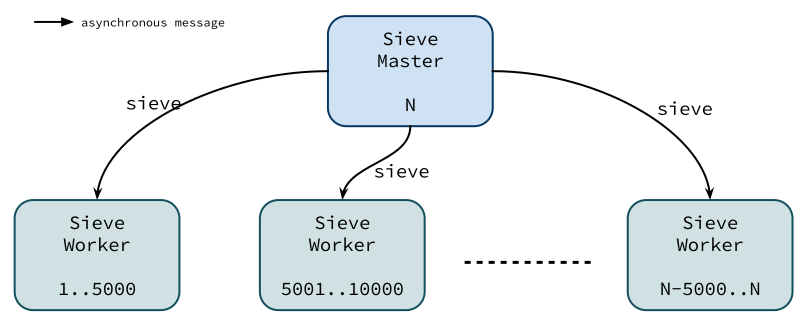

# Design Pattern 

We design and implement a [prime sieve generator][1] using [ABS API][2]. In this example, we strictly follow [object-oriented design principles][3] and eventually mix in the actor model with the implementation.

The following summarizes the prime sieve generation:

1. The implementation works with a fixed input number `N`.
2. The result is a sequence of prime numbers less than or equal to `N`.
3. The implementation is required to be *concurrent* and *asynchronous*.

The following diagram depicts a general object hierarchy and structure of a concurrent prime sieve generator in this example:

[1]: http://en.wikipedia.org/wiki/Sieve_of_Eratosthenes
[2]: https://github.com/CrispOSS/abs-api-parent
[3]: http://en.wikipedia.org/wiki/Object-oriented_programming
