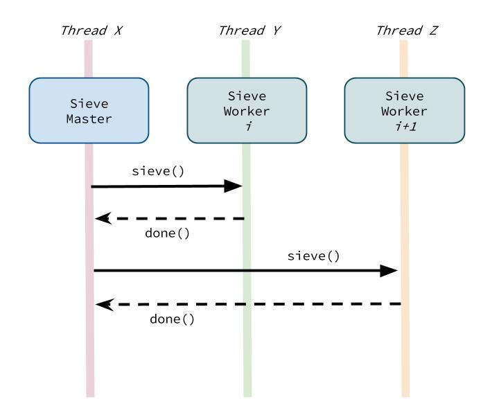

# Design Pattern 

We design and implement a [prime sieve generator][1] using [ABS API][2]. In this example, we strictly follow [object-oriented design principles][3] and eventually mix in the actor model with the implementation.

The following summarizes the prime sieve generation:

1. The implementation works with a fixed input number `N`.
2. The result is a sequence of prime numbers less than or equal to `N`.
3. The implementation is required to be *concurrent* and *asynchronous*.

The following diagram depicts a general structure of the prime sieve generator in this example:


* `SieveMaster` creates a number of buckets; i.e. `SieveWorker`, each of which are responsible for a specific range.
* The bucket size is chosen as `5000` as a fixed number is this example.
* `SieveMaster` sends a message `sieve` to all `SieveWorker`s.
* When a `SieveWorker` finishes its computation it responds to the master by sending a message `done`.
* When the last worker is done, the prime generation completes. 

Next, we design a Java interface for the prime sieves. Both `SieveMaster` and `SieveWorker` are different implementations of [`Sieve`][sieve]:

```java
interface Sieve {
  void sieve();
  void done(List<Long> primes);
  Long last();
}
```

The above interface allows `SieveMaster` to:

1. break the input `N` into a number of buckets
2. create a `SieveWorker` for every bucket
3. initiate the algorithm with the first worker and moving on one by one when each worker is done
4. return `last()` when the last worker finishes the computation

The following presents the above steps in `SieveWorker`'s `sieve()` method:

```
SieveWorker w = getNextWorker() or finish
(M) send a message to `w` to `sieve`
```

and equivalently in `SieveWorker`'s `done(List<Long> primes)` method:

```
Collect generated `primes`
`sieve` again
```

When `sieve()` in the master is done, the collected primes are the generated prime numbers up to input `N`.

The interesting part of the problem above in master's `sieve()` method is:

```
(M) send a message to `w` to `sieve`
```

We model *a message* by using 

1. `java.lang.Runnable` to present a message with no interest in its return value
2. `java.util.concurrent.Callable<V>` to present a message with a specific type of return value `<V>`

Through this model, we **separate** *message delivery* from *message execution*. Essentially, a message execution is eventually running the method invocation encapsulated in `Runnable` or `Callable`.

For example:

1. a message can be delivered in the same thread but executed in a different thread
2. a message can be delivered in a separate thread but executed in the same delivery thread
3. a message can be delivered in a separate thread and executed in a thread again different from the delivery thread

The above models of message delivery and execution build the foundation for *synchronous* and *asynchronous* message passing in ABS API. By default, ABS API uses the 3rd approach in which all objects in the runtime of the system share the same pool of threads.

We present `(M)` in the following as:

```java
Runnable msg = new Runnable() {
  void run() {
    w.sieve();
  }
}
```

In Java 8, we can simply use [Lambda expressions][lambda], so:

```java
Runnable msg = () -> w.sieve();
```

If we want to rewrite `(M)` from the above:

```java
Runnable msg = () -> w.sieve();
send(w, msg);
```

in which `send(Object, Object)` is expected to be a method that semantically provides Approach 2 explained above to deliver the message and execute it. Now the question is where `send(Object, Object)` can come from?

Next, let us zoom at `SieveWorker`. A `SieveWorker` is also a `Sieve` implementation a sketch of which can be presented as:

```
Sieve my range for prime numbers
(W) Reply to the "sender" with generated prime numbers
```

When a sieve worker has generated the prime numbers in its own range, it is expected to reply back to the master. We designed `void done(List<Long>)` for this purpose in `Sieve`. We can rewrite `(W)` from above as:

```java
List<Long> primes = // compute primes in my range
(W) Reply to master (sender) with message with invoking `done(primes)`
```

which means as before, we need to *send a message* but the difference here is that this is a *reply message*. We can rewrite then as:

```java
List<Long> primes = // compute primes in my range
Runnable replyMsg = () -> {
  (S) Sieve sender = sender();
  s.done(primes);
};
(R) reply(replyMsg);
```

We can *functionally* define `reply` in `(R)` as:

```
reply = send(sender(), Object)
```

in which `sender()` in `(S)` refers to the *sender* object of the current message being processed by `this` object.

Naturally, we need to sketch the implementation of `done(List<Long>)` in `SieveMaster` as it will be the main receive of done messages:

```java
void done(List<Long> primes) {
  Store the primes
  sieve();
}
```

Simply, after each receipt of `done`, the master stores the newly generated primes and sieve again to see if there are still sieve workers to do their computation.

We summarize the requirements that we have to be able to design this example following both object-oriented design and asynchronous computation:

* `send(Object o, Object msg)` sends a message `msg` to an object `o` in an asynchronous way
* `sender()` refers to the sender object of the currently being processed message in `this` object
* `reply(Object msg)` send a message `msg` as a reply to the `sender()` of the processed message in `this` object

This is where we mix object-oriented principles with Actor model brought by ABS API. To add the above capabilities to our example, we simple change `Sieve` interface as:

```java
interface Sieve extends Actor {
}
```

to extend `abs.api.Actor` interface. Now, all implementations of `Sieve` interface have access to the methods we draw as expectations for this example. Applying the actor model API to this sieve example as explained above can be depicted conceptually as:



## Conclusion

TODO: Generalize how we mixed the original object-oriented principles and Actor model principles implemented in ABS API through Java 8.

[1]: http://en.wikipedia.org/wiki/Sieve_of_Eratosthenes
[2]: https://github.com/CrispOSS/abs-api-parent
[3]: http://en.wikipedia.org/wiki/Object-oriented_programming
[sieve]: https://github.com/CrispOSS/prime-sieves/blob/master/src/main/java/com/github/crisposs/sieves/Sieve.java
[lambda]: https://docs.oracle.com/javase/tutorial/java/javaOO/lambdaexpressions.html
